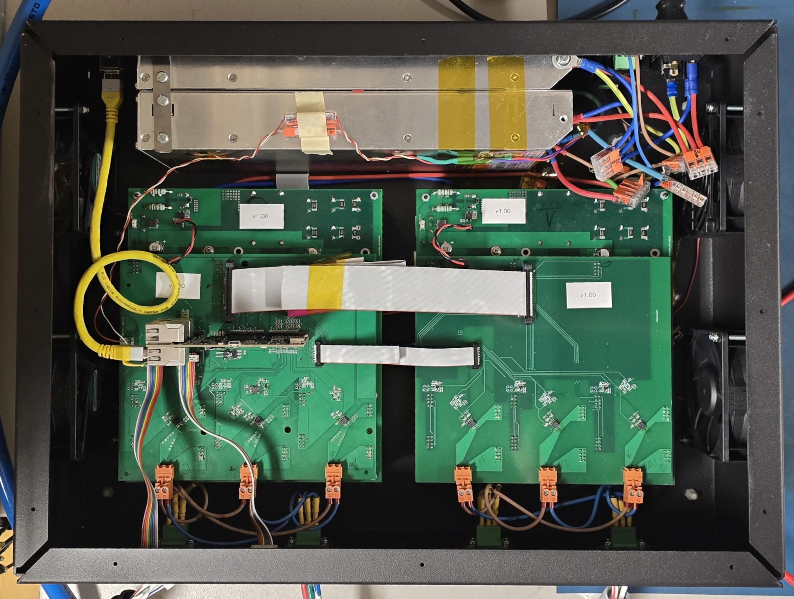

# `mdriver` firmware repository
This repository contains the firmware code for the `MDriver` electromagnet driver based on the `TMS320F28388D` control card from Texas Instruments.

- The compatible **hardware version** is `MDriver v1.0`.
- The [`mdriver_ros2`](https://github.com/dvarx/mdriver_ros2) repo contains the ROS2 driver to interface with the hardware using ROS2
- The [`mdriver_hw`](https://github.com/dvarx/mdriver_hw) repo contains the hardware design files

## Instructions
- Ensure that the `S2` SMD switches on the control card are configured for booting from FLASH memory when programming the card.